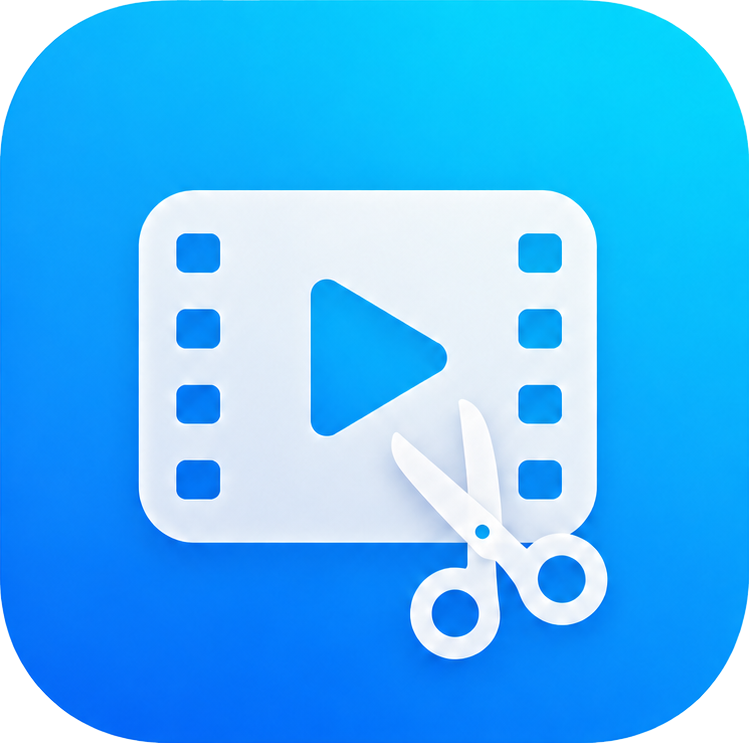

<p align="center">
  
</p>

<h1 align="center">Video Editor</h1>

<p align="center">
  <b>Editor de video que funciona por completo en el navegador.</b> Monta la línea de tiempo con
  varios niveles, corrige el color con ruedas y curvas, censura lo que se mueve, dibuja y añade
  texto, imágenes y figuras, aplica efectos y exporta el archivo terminado.
  <i>Sin instalar nada y sin que tus videos salgan de tu equipo.</i>
</p>

<p align="center">
  <a href="README.md">Español</a> · <a href="README.en.md">English</a>
</p>

<p align="center">
  <a href="https://github.com/Cris223511/video-editor/releases/latest"></a>
  
  
  
  <a href="LICENSE"></a>
</p>

---

## Demo en vivo

Video Editor se usa directamente en el navegador, sin instalar nada ni crear una cuenta.

**[video-editor-plus.vercel.app](https://video-editor-plus.vercel.app)**

Ábrelo, arrastra un video y empieza a editar. Los cambios de cada versión están en el [historial de cambios](CHANGELOG.md).

## Por qué

Editar un video corto no tendría que obligarte a instalar un programa que ocupa gigas, abrir una cuenta o subir tu material a un servidor ajeno. Los editores de escritorio son potentes, pero pesan y tienen una curva de aprendizaje larga. Los que viven en la web suelen cobrar una suscripción, estampar una marca de agua sobre el resultado o procesar los videos en sus propias máquinas.

Video Editor toma otro camino. Todo el trabajo ocurre dentro del navegador, de modo que importas, editas y exportas sin que ningún fotograma abandone tu equipo. Es gratuito, de código abierto, y no reserva ninguna función detrás de un pago.

### Para quién es

Está pensado para quien tiene un video concreto entre manos y quiere resolverlo el mismo día. Un recorte con música, una pieza vertical para redes, un tutorial grabado de la pantalla o una entrevista en la que hay que tapar una cara o una matrícula. No pretende reemplazar a una suite profesional de escritorio, sino ocuparse del trabajo cotidiano y hacerlo de forma directa.

## Características

### Importación y medios

- **Importación con validación.** Arrastras o eliges videos, imágenes y audios, y antes de sumarlos al proyecto se comprueba su tipo, su tamaño y su firma binaria real, no solo la extensión. En video se aceptan MP4, WebM, MOV, MKV, M4V y OGV, con un tope de 1,5 GB por archivo. El contenedor AVI se rechaza al importar con un aviso claro, porque el navegador no puede decodificarlo; el MKV sí funciona cuando lleva un códec web dentro.
- **Imágenes y audio con amplio soporte.** Las imágenes admiten PNG, JPG, WebP, GIF, AVIF, BMP, SVG, ICO, TIFF y HEIC, hasta 5 MB. El audio acepta MP3, WAV, OGG, M4A, AAC, FLAC, OPUS y otros formatos corrientes.
- **Biblioteca de medios.** Los archivos importados quedan a un lado con su miniatura, su resolución, su duración y su peso, listos para llevarlos a la línea de tiempo cuando los necesites.
- **Sin límite de cantidad.** El proyecto admite tantos medios como aguante tu equipo, igual que un editor de escritorio.

### Línea de tiempo

- **Hasta seis niveles de video.** Los clips se apilan en pistas independientes y se arrastran de una a otra sin perder su sitio en el tiempo. El nivel de arriba es el que se ve, y cada uno ajusta su altura tirando de su borde inferior. Cada pista se puede silenciar, ocultar o bloquear, reordenar hacia arriba o hacia abajo, e insertar una nueva entre dos existentes.
- **Filas de texto, figuras y audio.** Además del video, los carriles de texto y figuras y el de audio admiten varias filas para separar los elementos que coinciden en el tiempo, hasta seis en cada carril. Un elemento cambia de fila arrastrándolo, y el carril crece con un botón cuando hace falta más sitio.
- **Orden de apilado.** Cuando dos elementos se pisan sobre el lienzo, se decide cuál queda encima con «traer al frente» y «enviar atrás», sin mover su posición ni su tramo de tiempo.
- **Recorte y división.** Ajustas la entrada y la salida de cada clip tirando de sus bordes, o partes el clip por donde esté el cabezal. El recorte no es destructivo, así que el material que dejaste fuera sigue disponible si cambias de idea.
- **Imantado al arrastrar.** Los clips se pegan al inicio, al cabezal y a los bordes de los demás clips, capas y franjas de audio, así encajan sin dejar milésimas de hueco.
- **Velocidad por clip.** De 0,25x a 4x, con ajustes rápidos para los valores de siempre. El clip conserva el mismo trozo de video y lo que ocupa en la pista se recalcula solo.
- **Cierre de espacios vacíos.** Cuando queda un hueco entre dos clips se marca con borde discontinuo, y al cerrarlo todo lo que venía detrás en ese nivel se adelanta justo lo que medía. Los demás niveles no se tocan, para no romper la sincronía.
- **Copiar, pegar y duplicar.** Ctrl+C copia el elemento elegido y Ctrl+V lo pega en el cabezal, y con Alt pulsado el arrastre suelta una copia dejando el original en su sitio. Todo el montaje se deshace y rehace con Ctrl+Z y Ctrl+Y.
- **Tira de fotogramas.** Cada clip muestra su contenido en miniaturas repartidas a lo largo de su duración, no una sola imagen estirada, así se reconoce de un vistazo sin tener que reproducirlo.

### Transformar y recortar

- **Transformar.** Al seleccionar un texto, una imagen, una figura o un dibujo se puede girar en pasos de noventa grados, voltear en horizontal o en vertical y regular la opacidad. Los clips de video se voltean en espejo.
- **Recortar la imagen.** Un recuadro con líneas finas, guías de tercios y ocho agarres sobre el visor recorta el clip de video o la imagen. Lo que queda fuera deja pasar el fondo o las capas de debajo, y sale idéntico en el archivo exportado porque el visor y la exportación aplican el mismo recorte.

### Dibujo a mano alzada

- **Pincel sobre el video.** Se dibuja libremente encima del montaje eligiendo color y grosor. El trazo se comporta como una capa más, con su tramo de tiempo, y se puede mover, girar y animar igual que el resto.

### Transiciones

Hay **veintiuna transiciones**, repartidas en cinco familias y descritas como datos en un único catálogo. Eso es lo que garantiza que lo que ves al editar sea idéntico a lo que sale exportado, porque el visor y el compositor ejecutan el mismo motor.

- **Sin transición.** El corte seco, un plano entra justo donde acaba el anterior.
- **Atenuaciones.** Fundido con el plano anterior, fundido a negro y fundido a blanco.
- **Barridos.** A la derecha, a la izquierda, hacia arriba, hacia abajo y en diagonal, con el borde del recorte ligeramente difuminado para que no se vea barato.
- **Formas y aperturas.** Persianas, puertas horizontales, puertas verticales, barrido circular, rombo y tercios.
- **Zooms y empujes.** Empujar en las cuatro direcciones, acercar y alejar.

La galería lleva buscador propio, que ignora mayúsculas y tildes porque es como la gente escribe de verdad, y cada muestra ejecuta la transición al pasar el cursor por encima. La duración va de 0,2 a 2 segundos y también se ajusta tirando del borde de la transición en la propia línea de tiempo.

### Corrección de color

- **Ruedas por zona tonal.** Tres ruedas independientes para sombras, medios y luces. Arrastras hacia el color que quieras dar a cada zona, con Shift afinas el movimiento y con doble clic la rueda vuelve al centro.
- **Curvas por canal.** Cuatro curvas editables, una maestra de luz y una por cada canal de rojo, verde y azul. Se añaden puntos con un clic, se doblan arrastrando y se quitan con doble clic.
- **Ajustes de tono.** Exposición, contraste, saturación, temperatura y tinte, todos de -100 a 100.

Todo se aplica en vivo sobre el visor y llega igual al archivo exportado, porque las ruedas viajan como curva por canal en lugar de recalcularse aparte. La corrección de color funciona tanto en los clips de video como en las imágenes superpuestas.

### Efectos

- **Desenfoque de movimiento** aplicado al clip, con la posibilidad de sumar y ajustar efectos sobre el video. El catálogo se irá ampliando en próximas versiones.

### Censura en movimiento

- **Tres formas.** Círculo, rectángulo o pincel libre, con el que dibujas la máscara sobre el propio video y decides el grosor del trazo.
- **Tres efectos.** Pixelar, difuminar o tapar del todo, con la intensidad regulable en los dos primeros.
- **Recorrido grabado con el cursor.** Reproduces el video y arrastras el elemento siguiendo lo que quieres tapar. Cada instante queda guardado como un punto.
- **Cámara lenta al grabar.** El video se puede reproducir a mitad o a un cuarto de velocidad mientras dura la grabación, que es lo que permite seguir una cara o una matrícula que se mueve rápido. El recorrido se guarda en el tiempo real del video, no en el ralentizado.
- **Recorrido editable.** El trazado se dibuja sobre el visor y cualquier nodo se arrastra para corregir por dónde pasa, o se borra con doble clic. También se añade un punto suelto en la posición del cabezal.

El movimiento no es exclusivo de la censura. Los textos, las imágenes, las figuras y los dibujos se animan con los mismos controles.

### Capas sobre el video

- **Texto.** Contenido, doce tipografías que se previsualizan escritas con su propia letra, tamaño de 8 a 400 px, negrita, cursiva, subrayado, alineación, color y opacidad. Admite además interlineado y espaciado entre letras, fondo propio con su color y su opacidad, contorno con color y grosor, sombra y un resplandor de tipo neón.
- **Imágenes.** Logos y fotos superpuestos, con tamaño del 3 al 200 % del ancho del lienzo, opacidad, corrección de color propia y recorte con la misma herramienta de recuadro que el video. Se pueden deformar libremente o devolverles su proporción original.
- **Figuras.** Rectángulo, redondeado, elipse, triángulo, estrella, línea y flecha, con relleno y borde independientes, o color y grosor en el caso de la línea y la flecha.
- **Marco.** Diez estilos decorativos alrededor del video, entre ellos sólido, doble, discontinuo, punteado, redondeado con radio ajustable, sombra, neón, degradado, viñeta y polaroid.

Cada capa se mueve y se redimensiona con ocho tiradores en el visor, manteniendo la proporción si pulsas Shift, y en la línea de tiempo se decide de qué segundo a qué segundo aparece.

### Audio

- **Volumen general** del proyecto, de 0 a 200 %, con un botón de silencio que recuerda el nivel anterior.
- **Franjas de volumen.** Añades un tramo, lo colocas y lo recortas en la línea de tiempo, y le das su propia ganancia entre 0 y 200 %. Sirve para bajar la música justo donde alguien habla, o para silenciar solo un fragmento.
- **Separar el audio de un video.** El sonido de un clip se extrae a su propia pista, enlazado al video de origen, para moverlo, recortarlo o darle su propio volumen por separado.

### Lienzo

- **Seis proporciones.** 16:9, 9:16, 1:1, 4:5, 4:3 y 3:4, o el ajuste automático a las medidas del primer video.
- **Relleno de las bandas.** Cuando el video no cubre todo el lienzo, las zonas sobrantes se rellenan con un color a elegir o con el propio video ampliado y desenfocado, con el nivel de desenfoque regulable. Es lo habitual para colocar una toma vertical en un lienzo apaisado sin dejar dos franjas planas.

### Exportación

- **Todo dentro del navegador.** El proyecto se reproduce dibujando cada fotograma en un lienzo a la resolución elegida, se mezcla el audio con Web Audio y se graba todo junto con MediaRecorder.
- **Formato según el navegador.** Se prefiere MP4 con H.264 y AAC, y si el navegador no lo admite se cae a WebM con VP9 o VP8. El archivo se descarga solo al terminar.
- **24, 30 o 60 imágenes por segundo,** a elegir antes de empezar. El peso estimado del archivo se muestra antes de exportar y se ajusta según los cuadros por segundo elegidos.
- **Sin perder calidad.** La tasa de bits se calcula a partir de la resolución y de los cuadros por segundo, con un techo de 40 Mbps, y el audio queda sincronizado.
- **Progreso y cancelación.** Se ve el avance en porcentaje y se puede parar a mitad. Al hacerse en tiempo real, un video de un minuto tarda alrededor de un minuto en exportarse.

### Proyectos guardados

- **Guardado en el propio navegador.** Los proyectos viven en IndexedDB con sus videos incluidos, no como texto, así que no se pierden al cerrar la pestaña. El proyecto conserva su identidad entre guardados, de modo que volver a guardar actualiza el mismo en lugar de ir dejando copias.
- **Autoguardado con cualquier cambio.** Cualquier acción que toque el montaje, por pequeña que sea, guarda el proyecto alrededor de un segundo después. Borrar un clip, silenciar o reordenar una pista, sumar un nivel, mover una capa, cambiar el fondo o el volumen, todo queda a salvo sin acordarse de guardar. Hay un aviso en la barra superior mientras el guardado está en curso y otro antes de cerrar la pestaña con trabajo pendiente. Lo único que no dispara un guardado es mover el cabezal o cambiar de herramienta, porque ahí no se edita nada.
- **Descarga e importación.** Un proyecto se empaqueta en un archivo `.veproj` con sus medios dentro, listo para llevarlo a otro equipo y volver a abrirlo. Al importarlo recibe una identidad nueva, así traerlo dos veces no pisa lo que ya tenías.
- **Listado con buscador,** que ignora mayúsculas y tildes, cuatro criterios de orden y paginación de seis en seis. Cada tarjeta muestra portada, duración, número de medios y las fechas de creación y última edición.
- **Duplicar, descargar y borrar** desde la propia tarjeta, con confirmación antes de eliminar porque se van también los videos guardados.
- **Ficha de detalles.** Cada proyecto abre una ficha con lo que se sabe de él y de sus archivos, desde los clips, los niveles y las capas hasta la resolución y la proporción de salida, el espacio ocupado y, por cada medio, sus dimensiones, orientación, duración, formato y megapíxeles.
- **Dirección propia.** Cada proyecto abierto tiene su enlace, así que se puede recargar la página o guardar el marcador sin perder en cuál estabas trabajando.
- **Aviso de espacio.** La aplicación consulta cuánto reserva el navegador en el equipo y cuánto llevas usado, para avisar antes de que un guardado se rechace por falta de sitio.

### Sitio de presentación

La aplicación no arranca en el editor, sino en un sitio que explica lo que hace y deja probarlo antes de importar nada.

- **Portada con demostraciones que funcionan de verdad.** Las ruedas de color, ocho de las veintiuna transiciones, la censura con su recuadro arrastrable, los controles del visor y el cambio de proporción del lienzo. No son videos grabados, ejecutan el mismo motor que el editor.
- **Recorrido por las herramientas,** que van pasando solas hasta que tocas una, con el montaje y la exportación representados en maquetas animadas.
- **Preguntas frecuentes** y el paso a paso de cómo se monta un video de principio a fin.
- **Manual de uso** en su propia página, con el montaje, el color, las capas, la censura, el guardado y la exportación explicados paso a paso, además de la tabla de atajos.
- **Términos y condiciones** y **política de privacidad,** escritas para entenderse leyéndolas una vez, con índice lateral que se genera a partir de las propias secciones y va marcando por dónde vas leyendo.

### Interfaz

- **Tema claro y oscuro,** con el claro por defecto y un fundido entre ambos en lugar de un salto seco.
- **Catorce herramientas** en un riel lateral fijo, que son proyecto, transiciones, lienzo, marco, texto, figura, dibujar, transformar, recortar, audio, censura, velocidad, tono y efectos. El riel sigue visible aunque pliegues el panel. Las imágenes no ocupan una herramienta propia porque se añaden arrastrándolas desde la biblioteca de medios.
- **Panel de opciones contextual.** Cada herramienta muestra solo sus controles, y lo que ajustas se ve en el visor mientras lo mueves. Seleccionar un clip, una capa o una franja abre directamente su herramienta.
- **Paneles ajustables,** para dar más sitio al visor o a la línea de tiempo según lo que estés haciendo.
- **Todo local,** sin cuentas, sin marcas de agua y sin funciones de pago.

## Atajos de teclado

| Acción | Atajo |
| ------ | ----- |
| Reproducir o pausar | `Barra espaciadora` |
| Dividir en el cabezal | `S` |
| Borrar lo seleccionado (clip, capa o franja de audio) | `Supr` o `Retroceso` |
| Copiar y pegar | `Ctrl+C` y `Ctrl+V` |
| Deshacer y rehacer | `Ctrl+Z` y `Ctrl+Y` |
| Mover el cabezal un fotograma | `←` y `→` |
| Mover el cabezal un segundo | `Shift` + `←` o `→` |
| Ir al principio o al final | `Inicio` y `Fin` |
| Acercar o alejar la línea de tiempo | `+` y `-`, o `Ctrl` + rueda del ratón |
| Soltar la selección | `Esc` |

No hay atajo para guardar porque no hace falta: el proyecto se guarda solo con cada cambio. Mientras escribes en un campo de texto los atajos no se disparan, así que la barra espaciadora escribe un espacio en lugar de partir el video. Con una censura seleccionada, las flechas dejan de mover el cabezal y ajustan su caja.

## Requisitos

Un navegador de escritorio reciente basado en Chromium o en Firefox. No hace falta instalar nada, ni conceder permisos, ni mantener la conexión una vez cargada la página. Para guardar proyectos conviene tener espacio libre en disco, porque incluyen los videos completos.

## Ejecutar en local

Solo hace falta **Node.js 18** o superior.

```
npm install
npm run dev
```

Vite levanta la aplicación en `http://localhost:5173`.

## Comandos

| Comando | Qué hace |
| ------- | -------- |
| `npm run dev` | Servidor de desarrollo con recarga en caliente. |
| `npm run build` | Comprueba los tipos y genera la versión de producción en `dist`. |
| `npm run preview` | Sirve en local el resultado del build. |

## Tecnologías

| Componente | Herramienta | Para qué se usa |
| ---------- | ----------- | --------------- |
| Interfaz | [React 18](https://react.dev/) y [TypeScript 5](https://www.typescriptlang.org/) | La aplicación y sus componentes, con tipado estricto |
| Empaquetado | [Vite 5](https://vite.dev/) | Servidor de desarrollo y build de producción |
| Estilos | [Tailwind CSS](https://tailwindcss.com/) | El diseño y el tema claro u oscuro |
| Estado | [Zustand](https://zustand-demo.pmnd.rs/) | El estado del proyecto, el editor, el tema y la vista |
| Navegación | [React Router](https://reactrouter.com/) | Una dirección por vista, recargable y compartible |
| Animación | [Framer Motion](https://www.framer.com/motion/) y [Lenis](https://lenis.darkroom.engineering/) | Las transiciones de la interfaz y el desplazamiento suave del sitio |
| Componentes | [Radix UI](https://www.radix-ui.com/), [Embla](https://www.embla-carousel.com/), [react-resizable-panels](https://github.com/bvaughn/react-resizable-panels) | Diálogos, acordeones, menús, carruseles y paneles ajustables |
| Detalles de UI | [lucide-react](https://lucide.dev/), [react-colorful](https://omgovich.github.io/react-colorful/), [Sonner](https://sonner.emilkowal.ski/) | Iconos vectoriales, selectores de color y avisos |
| Tipografías | Inter y Plus Jakarta Sans | Servidas desde el propio paquete, sin pedirlas a terceros |
| Exportación | Canvas, Web Audio y MediaRecorder | Render y grabación del video, todo en el navegador |
| Almacenamiento | IndexedDB | Los proyectos guardados con sus medios |

El motor de edición (validación, análisis de medios, color, transiciones, compositor y exportación) vive en `src/lib`, **separado de la interfaz** de `src/components` y `src/features`, para que la lógica no dependa de React.

## Estructura del proyecto

```
video-editor/
├── index.html
├── vite.config.ts            cabeceras COOP/COEP por si más adelante se usa WebCodecs
├── vercel.json               las mismas cabeceras en producción
├── tailwind.config.js
└── src/
    ├── main.tsx              punto de entrada
    ├── App.tsx               raíz de la aplicación
    ├── rutas.tsx             enrutador y direcciones de cada vista
    ├── rutasDef.ts           las direcciones en un solo sitio
    ├── index.css             tokens del tema y estilos base
    ├── config/               versión, límites y formatos aceptados
    ├── types/                tipos del dominio (medios, capas, audio, marco, tiempo)
    ├── lib/                  motor sin dependencia de react
    │   ├── validation/       validación de archivos (tipo, tamaño, firma)
    │   ├── media/            análisis de video y miniaturas
    │   ├── layers/           capas, movimiento, geometría y guías
    │   ├── color/            ruedas, curvas y ajustes de tono
    │   ├── transiciones/     catálogo, motor y pintado
    │   ├── audio/            ganancia por franjas
    │   ├── timeline/         cálculos de la línea de tiempo
    │   ├── proyecto/         almacén, empaquetado y sesión
    │   ├── export/           compositor y exportación
    │   ├── scroll/           desplazamiento suave del sitio
    │   └── format/           utilidades de formato
    ├── store/                estado global (tema, proyecto, editor, vista)
    ├── components/
    │   ├── ui/               iconos, avisos, controles, ruedas y curvas
    │   ├── sitio/            piezas y demostraciones de la presentación
    │   └── layout/           barra superior, navegación y pie
    └── features/
        ├── sitio/            portada, manual, legales y página no encontrada
        ├── import/           pantalla de importación
        ├── proyectos/        listado y ficha de los proyectos guardados
        └── editor/           visor, paneles, línea de tiempo y exportación
```

## Privacidad

> **Tus videos se procesan por completo en tu equipo.** Nada se sube a ningún servidor, ni mientras editas ni al exportar. No hay cuentas, ni seguimiento, ni analítica. Los proyectos que guardas se quedan en el almacenamiento de tu propio navegador, y borrarlos desde la aplicación los elimina de verdad.

## Contribuir

Los reportes de errores y las ideas son bienvenidos en los [issues](https://github.com/Cris223511/video-editor/issues). Para aportar código, abre un *pull request*. El proyecto se ejecuta con `npm install` y `npm run dev`, sin ninguna configuración adicional.

## Licencia

**MIT** © [Cris223511](https://github.com/Cris223511). Puedes usarlo, modificarlo y compartirlo con libertad. El texto completo está en el archivo [LICENSE](LICENSE).

*Si el proyecto te resulta útil, una estrella en el repositorio ayuda a que más personas lo encuentren.*
